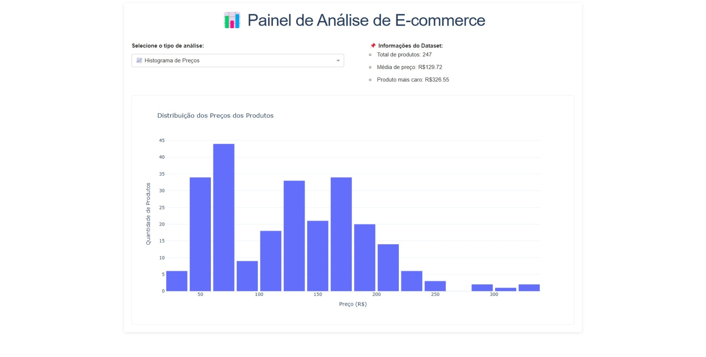

# 📊 Painel de Análise de E-commerce

Um painel interativo desenvolvido em Python usando Dash e Plotly para análise de dados de e-commerce, proporcionando insights visuais sobre produtos, preços, marcas e vendas.



## 🚀 Recursos do Projeto

- **Visualizações interativas** de dados de e-commerce
- **7 tipos de gráficos** diferentes para análise
- **Interface amigável** com seleção dropdown
- **Design responsivo** e moderno
- **Estatísticas automáticas** do dataset

## 📋 Gráficos Disponíveis

1. **📈 Histograma de Preços** - Distribuição dos preços dos produtos
2. **🟢 Dispersão Preço×Avaliações** - Relação com quantidade vendida
3. **🔥 Mapa de Calor** - Correlações entre variáveis numéricas
4. **📊 Top Marcas** - 7 marcas mais populares
5. **🍕 Distribuição por Gênero** - Proporção dos principais gêneros
6. **🌊 Densidade de Preços** - Concentração de faixas de preço
7. **📉 Regressão Linear** - Relação entre preço e quantidade vendida

## 🛠️ Tecnologias Utilizadas

- Python 3.x
- Dash (Framework web)
- Plotly (Visualização de dados)
- Pandas (Manipulação de dados)
- Statsmodels (Análise estatística - opcional)
-  Gunicorn (para deploy)

## 🖥️ Como acessar

- Navegador moderno (Chrome, Firefox, Edge, etc.).
- Conexão com a internet (para carregar recursos externos, se houver).
- Acesse: [https://painel-interativo-de-analise-de-dados-de.onrender.com/](https://painel-interativo-de-analise-de-dados-de.onrender.com/)
- Aguarde o servidor carregar a aplicação (O serviço é grátis então demora uns minutos)


## 🚀 Como Executar

### Pré-requisitos

- Python 3.7+
- pip

### Instalação Local

1. Clone o repositório:
   ```bash
   git clone https://github.com/srkael/painel-de-analise-de-ecommerce.git
   cd painel-de-analise-de-ecommerce
   ```

2. Crie e ative um ambiente virtual (recomendado):
   ```bash
   python -m venv venv
   source venv/bin/activate  # Linux/Mac
   venv\Scripts\activate    # Windows
   ```

3. Instale as dependências:
   ```bash
   pip install -r requirements.txt
   ```

4. Execute a aplicação:
   ```bash
   python app.py
   ```

5. Acesse no navegador:
   ```
   http://localhost:8050
   ```

### Deploy no Render

1. Crie uma nova conta no [Render](https://render.com/)
2. Conecte seu repositório GitHub
3. Configure como serviço Web
4. Defina o comando de inicialização:
   ```
   gunicorn app:server
   ```
5. Defina a porta como `8050`

## 📁 Estrutura do Projeto

```
painel-de-analise-de-ecommerce/
├── app.py                # Código principal da aplicação
├── ecommerce_estatistica.csv  # Dataset de exemplo
├── requirements.txt      # Dependências do projeto
├── README.md             # Este arquivo
└── venv/                 # Ambiente virtual (gerado)
```

## 📊 Sobre o Dataset

O projeto utiliza um arquivo CSV (`ecommerce_estatistica.csv`) contendo dados de produtos de e-commerce com as seguintes colunas:

- `Preço`: Valor do produto
- `Qtd_Vendidos`: Quantidade de itens vendidos
- `N_Avaliações`: Número de avaliações
- `Marca`: Fabricante do produto
- `Gênero`: Categoria do produto


## 🤝 Como Contribuir

Sinta-se à vontade para contribuir com o projeto, encontrou um bug ou tem uma sugestão? Abra uma [issue](https://github.com/srkael/painel-de-analise-de-ecommerce/issues) ou envie um pull request.


## 👨‍💻 Autor

- **Rafael de Oliveira Pereira**
- GitHub: [srkael](https://github.com/srkael)
- Linkedin: [Rafael de Oliveira](https://www.linkedin.com/in/srkael/)
